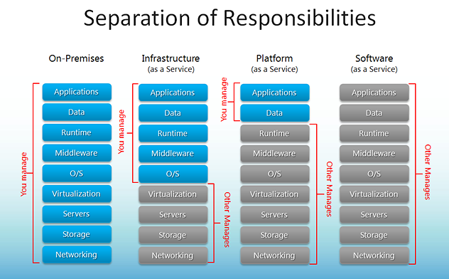

# 1회차 클라우드 스터디

<!-- _class: invert -->

- 일시: 2022. 05. 08
- 참석자: 김지형,
- 발표자: 김지형 <jaycol.kim@gmail.com>

## 서문

<!-- _class: invert -->

---

### 2021 IT 산업의 흐름 (1/2)

- 소프트웨어(운영체제, 앱)와 하드웨어에서
  1. 데이터경제
  2. 인공지능
  3. 고품질 5G
  4. 디지털트윈
     - 디지털전환의 핵심촉매
  5. 온택트
     - 비대면시대

---

### 2021 IT 산업의 흐름 (2/2)

- 소프트웨어(운영체제, 앱)와 하드웨어에서

  6. 디지털소비
     - 디지털플랫폼 기반 소비
  7. 홈코노미
     - 재택경제기반 경제의 급부상
  8. K-콘텐츠
     - 디지털 기반 플렛폼 경제로 전환-BAT, 유투브 등
  9. 빅테크기업
     - 빅테크기업플렛폼을 기반
  10. 디지털 통상
      - 데이터와 서비스 중심의 디지털통상으로 전환

---

### 2022 IT 산업의 흐름 (Gatner) (1/2)

- 금융 등 민간 분야에서도 디지털 전환의 급속한 추진
  1. 데이터패브릭
  <!-- 데이터패브릭은 비즈니스 사용자와 플랫폼 전반에 걸쳐 데이터소스의 유연하고 탄력적 통합을 제공 -->
  2. 사이버보안 메시 아키텍처,
  3. PEC(Privacy Enhancing Computation)
  4. 클라우드 네이티브 플랫폼
  <!-- 급속한 디지털변화에 대응할 수 있도록 -->
  5. 조합가능한 애플리케이션
  <!-- 코드를 더욱 쉽게 사용 및 재활용할 수 있으며 신규 소프트웨어 솔루션의 신속한 타임투마켓 출시를 가능케 해 기업들에게 가치를 제공 -->
  6. 의사결정 인텔리젼스
  <!-- 조직의 의사결정을 개선하기 위한 실용적인 접근법으로서, 의사결정이 이루어지는 방법을 명시적으로 이해하고 엔지니어링함으로써 의사결정을 개선하는 것 -->

---

### 2022 IT 산업의 흐름 (Gatner) (2/2)

- 금융 등 민간 분야에서도 디지털 전환의 급속한 추진

  7. 하이퍼오토메이션
  <!-- 가능한 한 많은 비즈니스 및 IT 프로세스를 신속하게 판별, 조사, 자동화하기 위한 비즈니스 기반 접근법 -->
  8. 인공지능엔지니어링
  9. 분산형기업
  <!-- 원격 및 하이브리드 근무패턴이 증가함에 따라 기존사무실 중심조직은 지리적으로 흩어진 근로자들로 구성되는 분산형기업(Distributed Enterprise)으로 진화 -->
  10. Total Experience.
  <!-- 비즈니스 전략으로서 전체경험(Total Experience. TX)은 여러 접점에 걸쳐 고객경험(CX), 직원경험(EX), 사용자경험(UX), 다중경험(MX) 등을 통합해 성장을 가속화하는 것 -->
  11. 자치시스템
  <!-- Autonomic Systems, 자신을 둘러싼 환경에서 학습해 자가 관리되는 물리적 혹은 소프트웨어시스템 -->
  12. 생성형AI
  <!-- 데이터로부터 얻어낸 결과를 학습해 원작과 유사하지만 독창적이고 새로운 결과물을 만들어내는 것 -->

> ["IT 서비스 시장의 화두와 2022년 전망", SPRI, 2021.12.27](https://spri.kr/posts/view/23364?code=data_all&study_type=industry_trend)

## 클라우드 컴퓨팅이란

<!-- _class: invert -->

---

### 클라우드 == N드라이브?

- 아직도 N드라이브나 구글 드라이브 같은 파일 저장 서비스를 떠올리는 이용자가 많은 것이 현실이다. 클라우드의 개념에 대해 조금 감을 잡은 사용자라도 인프라 서비스(IaaS), 플랫폼 서비스(PaaS) 같은 어려운 단어는 도통 이해하기 힘들다.
- 클라우드는 쉽게 말해 돈 대신 `데이터를 취급하는 은행`이다. 은행이 자본주의 시대의 꽃인 돈을 보관하고 빌려주는 서비스라면, 클라우드는 정보화 시대의 꽃인 데이터를 보관하고 인프라스트럭처(서비스 유지를 위한 IT 장비 모음)와 IT 기술을 빌려주는 서비스다.

<!-- 자본주의가 폭발적으로 발전할 수 있었던 이유가 뭘까? 여러 가지 이유가 있겠지만, 돈을 보관하거나 빌려줘서 기업이 신규 사업 추진을 위한 비용을 쉽게 조달할 수 있게 해주는 은행의 역할이 컸다. 은행의 중요성은 지금도 변함이 없다. 자본주의라는 시스템이 없어지지 않는 이상 은행은 계속 중요한 서비스일 것이다.

정보화 시대, 나아가 4차 산업혁명 시대에서는 이러한 은행 못지 않게 클라우드가 중요한 역할을 한다. 클라우드는 기업이 비즈니스 활동을 진행하면서 수집한 데이터를 보관, 정리, 분석하고 새로운 서비스를 빠르게 추진할 수 있도록 각종 인프라와 IT 기술을 빌려주는 서비스다. -->

---

### 주력 비즈니스의 집중을 위해

물론 기업이 직접 데이터를 보관, 정리, 분석하거나 인프라를 구축하고 IT 기술을 개발하는 방법도 있다. 지금도 이러한 방식을 고집하는 기업도 여전히 많다. 하지만 이는 비효율적인 면이 있는 게 사실이다. 모든 기업은 집중해야 할 주력 비즈니스가 있다. 수 많은 경쟁자를 제치고 험난한 비즈니스 세계에서 생존하려면 주력 비즈니스에 관련된 연구와 개발에 집중해야 한다. 주력 비즈니스가 아닌 인프라와 IT 기술 개발에 신경 쓸 틈이 없다. 때문에 많은 기업이 데이터 보관, 인프라와 IT 기술 개발 등을 클라우드에 넘기고 주력 비즈니스에만 신경 쓰고 있다.

> ["[클라우드 이해하기] ① 클라우드 컴퓨팅이란 무엇인가", 아주경제, 2020.03.30](https://www.ajunews.com/view/20200330041313279)

---

### 클라우드 컴퓨팅 시장 현황 (1/3)

클라우드는 대규모 인터넷 서비스를 제공하던 기업이 남아도는 자사 인프라와 내부에서 개발된 IT 기술을 비즈니스적으로 활용하기 위해 고안됐다는 게 통설이다. 남는 인프라와 IT 기술을 다른 기업에 빌려줘 수익을 얻는다는 아이디어다. 때문에 클라우드는 과거에도 그랬고, 지금도 대규모 인터넷 서비스를 제공하는 기업이 서비스를 제공하고 있다. 미국 최대의 인터넷 쇼핑몰 사업자 '아마존닷컴', 세계 최대의 검색엔진 '구글', 중국 최대의 인터넷 쇼핑몰 사업자 '알리바바' 등이 바로 대표적인 클라우드 사업자다. 국내 최대의 검색 엔진인 '네이버' 역시 이러한 클라우드 사업자 가운데 하나다.

---

### 클라우드 컴퓨팅 시장 현황 (2/3)

기술과 시장 영향력으로 기업과 서비스의 가치를 평가하는 가트너 매직 쿼드런트에 따르면, 2019년 기준 전 세계 클라우드 시장은 3강 3중의 형태로 진행되고 있다. 3강은 가트너 매직 쿼드런트의 리더(Leader) 등급인 업체다. 시장 영향력과 IT 기술을 모두 갖춘 기업이다. 아마존의 '아마존웹서비스(AWS)', 마이크로소프트의 '애저(Azure)', 구글의 '구글 클라우드 플랫폼(GCP)'이 여기 해당한다.

---

### 클라우드 컴퓨팅 시장 현황 (3/3)

IT 기술을 개발하던 업체가 인프라를 확충해서 클라우드 사업에 뛰어든 사례도 있다. 윈도 서버 등으로 리눅스와 X86 서버 시장을 양분하던 '마이크로소프트', 메인프레임과 유닉스 서버를 생산하던 'IBM' 등이 대표적인 사례다.

웹이나 서비스 호스팅 등 인프라 사업에 집중하던 업체가 IT 기술을 확보한 후 클라우드 사업에 뛰어들기도 한다. 미국의 'AT&T', '센추리링크'나 국내의 'KT' 등이 대표적인 사례다.

'삼성SDS', 'LG CNS', 'SK C&C', '베스핀글로벌', '메가존클라우드'처럼 클라우드 사업자와 협력해 기업의 클라우드 환경을 대신 구축해주는 업체도 늘어나고 있다

---

### 독주하는 3사 클라우드 (1/2)

3중은 가트너 매직 쿼드런트 비저너리(Visionary) 등급인 업체다. 시장 영향력은 리더 등급에 비해 떨어지지만, IT 기술은 리더 등급과 대등한 수준인 업체들이다. 오라클의 '오라클 클라우드', IBM의 'IBM클라우드', 알리바바의 '알리바바클라우드(알리윤)' 등이 여기에 해당한다.

즉 현재 글로벌 클라우드 시장은 AWS, 애저, GCP가 선도하고 있고, 오라클 클라우드, IBM클라우드, 알리바바클라우드 등이 셋을 따라잡기 위해 노력하는 양상으로 전개되고 있다.

---

### 독주하는 3사 클라우드 (2/2)

이러한 글로벌 클라우드 사업자의 독주를 견제하기 위해 네이버, NHN, KT 등도 '네이버 클라우드 플랫폼(NCP)', 'NHN 토스트', 'KT 클라우드' 등 독자적인 클라우드 서비스를 선보이고 있다. 특히 네이버의 경우 국내 데이터센터뿐만 아니라 글로벌 데이터센터를 확충하고 네이버 내부에서 개발된 다양한 IT 기술을 공개해 빠른 시일 내로 가트너 매직 쿼드런트 비저너리 등급을 확보할 계획이다.

> ["[클라우드 이해하기] ① 클라우드 컴퓨팅이란 무엇인가", 아주경제, 2020.03.30](https://www.ajunews.com/view/20200330041313279)

## 클라우드의 분류

<!-- _class: invert -->

---

### 클라우드의 3가지 형태

1. 퍼블릭 클라우드

<!-- 서비스 유지를 위한 모든 인프라와 IT 기술을 클라우드에서 받는 것이다. 기업 입장에선 인프라 구축에 비용을 투자하지 않아도 되고, 인프라 관리 인력도 최소화할 수 있다는 장점이 있다. 때문에 IT 관련 인력이 적거나 없는 기업, 또는 IT 관련 인력을 확충할 여유가 없는 스타트업 등이 선호하는 방식이다. 클라우드를 이용하는 많은 기업이 퍼블릭 클라우드 형태로 서비스를 이용하고 있다. -->

2. 하이브리드 클라우드

<!-- IT 기술은 클라우드에서 받지만, 서비스 유지를 위한 인프라를 클라우드의 것과 기업의 것을 혼용하는 형태다. 주로 클라우드에 기업의 핵심 데이터를 보관하길 꺼리는 기업이 활용하는 방식이다. 데이터는 기업의 인프라에 직접 보관하고 서비스 운용은 클라우드 인프라에서 진행한다. 또는 로컬(국내) 서비스는 기업의 인프라에서 제공하고, 글로벌(전 세계) 서비스는 클라우드 인프라에서 제공하는 식으로 하이브리드 클라우드를 활용하는 기업도 있다. -->

3. 프라이빗 클라우드

<!-- 기업이 직접 클라우드 서비스를 구축한 후 이를 계열사와 고객에게만 제공하는 형태다. 대규모 기업 집단이나 정부 등을 중심으로 선호하고 있다. 인프라 확충은 쉽지만, IT 기술을 확보하는 것은 쉽지 않기 때문에 글로벌 클라우드 사업자는 프라이빗 클라우드를 구축하길 원하는 기업이나 정부에게 IT 기술만 따로 패키징(포장)해서 판매하고 있기도 하다. -->

---

### 클라우드의 세 가지 핵심 서비스 (1/3)

클라우드는 단순히 인프라와 IT 기술을 제공하던 과거의 형태에서 벗어나 기업이 인프라와 IT 기술을 보다 편리하게 이용할 수 있도록 변화를 꾀하고 있다:

1. '인프라 서비스(Infra as a Service, IaaS)'에서
2. '플랫폼 서비스(Platform as a Service, PaaS)'와
3. '소프트웨어 서비스(Software as a Service, SaaS)'로 확대되고 있다는 설명이다.

---

### 클라우드의 세 가지 핵심 서비스 (2/3)

---

### 클라우드의 세 가지 핵심 서비스 (3/3)

#### 인프라 서비스 (Infra as a Service, IaaS)

- 인프라 서비스는 클라우드의 가장 기본적인 제공 형태다. 클라우드는 인프라와 IT 기술만 빌려주고, 이를 활용해 서비스를 구축하는 것은 기업과 기업 내 개발자의 몫이다. 보통 서버, 스토리지(저장장치), 네트워크 장비, 서버용 운영체제 등을 빌려주면 인프라 서비스라고 부른다.

- 그렇다고 클라우드 업체의 지원이 소홀한 것은 아니다. 클라우드 업체들은 가상머신, 오토스케일링 등 기업이 서비스를 구축하고 불편 없이 이용하는 데 필요한 모든 인프라 관련 기술을 제공하고 있다. 현재 대다수의 기업이 인프라 서비스를 이용해 자체 서비스와 앱을 개발하고 있다.

---

#### 플랫폼 서비스 (Platform as a Service, PaaS)

- 플랫폼 서비스는 인프라 서비스에서 한 단계 더 발전한 클라우드 서비스다. 인프라와 IT 기술을 빌려줄 뿐만 아니라 기업이 보다 빠르고 편하게 서비스를 구축할 수 있도록 다양한 지원 서비스를 함께 제공하는 것이다. 일반적으로 서버, 스토리지, 네트워크 장비, 서버용 운영체제뿐만 아니라 각종 개발도구까지 함께 제공하면 플랫폼 서비스라고 부른다. 사실 플랫폼 서비스라는 이름 자체가 '개발 플랫폼 제공 서비스'의 줄임말이다.

- 플랫폼 서비스는 크게 두 가지 방향으로 나눌 수 있다. 인프라 운영에 들어가는 노력을 최소화하거나 아예 없애주는 '서버리스 아키텍처'와 앱이나 서비스 개발을 보다 빠르고 편하게 해주는 '오픈 API(Application Programming Interface, 응용 프로그램 프로그래밍 인터페이스) 컴포넌트 제공'이다.
  <!-- 서버리스 아키텍처 기술을 활용하면 기업은 인프라 구축뿐만 아니라 운영에 들어가는 노력까지 절감할 수 있다. 클라우드에서 제공하는 오픈 API 컴포넌트를 활용하면 앱과 서비스를 개발하기 위한 기초 기술을 일일이 만들지 않아도 된다. 기초 기술은 클라우드에 맡겨두고 고급 서비스 개발에만 집중하면 된다. 이를 통해 서비스 개발 및 출시 기간을 극적으로 단축할 수 있다. -->

    <!-- 현재 대부분의 클라우드 사업자가 자사의 클라우드 서비스를 인프라 서비스 위주에서 플랫폼 서비스 위주로 바꾸기 위해 노력 중이다. 플랫폼 서비스가 인프라 서비스보다 좀 더 고부가가치(=이용료가 더 비싸다) 서비스이기 때문이다. -->

---

#### 소프트웨어 서비스 (Software as a Service, SaaS)

- 소프트웨어 서비스란 과거 PC나 서버 등에 설치해서 이용해야 했던 소프트웨어를 클라우드를 통해 제공하는 서비스다. 과거에는 소프트웨어 패키지를 구매해서 하드웨어(PC)에 설치해야 소프트웨어를 이용할 수 있었지만, 이제는 인터넷에만 연결되어 있으면 클라우드에 이미 설치되어 있는 소프트웨어를 받을 수 있다. 어도비, 오토데스크 등 해외의 유력 소프트웨어 업체뿐만 아니라 안랩, 한글과컴퓨터, 더존비즈온 등 국내의 대형 소프트웨어 업체들도 기존의 소프트웨어 패키지 대신 소프트웨어 서비스 중심으로 사업 모델을 바꾸고 있다.

## 클라우드의 장점과 단점

<!-- _class: invert -->

---

### 클라우드의 장점

1. 신속한 인프라 도입

<!-- 클라우드는 가입하고 10분 내로 인프라를 도입해서 서비스 구축을 시작할 수 있다. 주문한 서버가 도착하는데 2~3주의 시간이 걸렸던 예전과 비교할 수 없을 정도로 빠르다. 그만큼 인프라 도입에 들어가는 시간을 절감하고, 서비스 제공 시기를 앞당길 수 있다. -->

2. 유연한 인프라 관리

<!-- 과거에는 인프라를 도입하기에 앞서 서비스 구축에 어느 정도의 인프라가 필요할지 미리 예상해야 했다. 예상이 맞으면 다행이지만, 만약 예상이 빗나가면 인프라 부족 또는 잉여 인프라에 따른 과도한 비용 지출이라는 문제가 발생했다. 클라우드는 인프라를 실시간으로 자유롭게 증감할 수 있기 때문에 인프라 부족 또는 과도한 인프라 도입이라는 문제가 발생하지 않는다. 서비스의 규모가 확대되면 그에 맞춰 클라우드에서 인프라를 빌려오면 된다. -->

3. 예상치 못한 트래픽 폭주 대응

<!-- 과거에는 서비스에 사용자가 몰려 트래픽이 폭주하면 대응할 방법이 없었다. 남는 인프라가 있다면 다행이지만, 만약을 대비해 예비 인프라를 남겨두는 기업은 거의 없다. 트래픽이 폭주하면 기업은 사용자가 빠지길 기원하며 데이터 압축이나 사용자 순차 접속 등의 조치 밖에 취할 수 없었다.

반면 클라우드는 서비스의 트래픽이 폭주하면 이에 맞춰 재빨리 인프라를 늘릴 수 있다. 트래픽 폭주로 서비스가 중단되는 사태를 걱정할 필요가 없어진 것이다. 최근에는 이러한 트래픽 폭주에 맞춰 기업이 별도로 인프라를 확충하지 않아도 알아서 인프라를 늘렸다가, 트래픽이 줄어들면 이에 맞춰 인프라를 줄이는 자동 트래픽 증감 기술 '오토 스케일링'이 개발되어 기업이 더욱 편리하게 인프라를 관리할 수 있게 해주고 있다. -->

4. 손쉬운 글로벌 서비스

<!-- 많은 클라우드 사업자가 전 세계 주요 대륙에 데이터센터를 보유하고 있다. 보통 30~40개, 많은 곳은 100개가 넘는 데이터센터를 갖추고 있다. 이를 통해 기업은 전 세계 어디에나 빠른 서비스를 제공할 수 있다. 과거에는 글로벌 서비스를 위해 기업이 직접 특정 대륙 또는 지역별로 데이터센터를 구축해야 했지만, 이제는 클라우드 사업자가 미리 구축한 글로벌 데이터센터를 활용해 글로벌 서비스를 제공하면 된다. 그만큼 글로벌 서비스가 손쉬워진 것이다. 기업뿐만 아니라 규모가 작은 스타트업도 클라우드를 활용해 글로벌 서비스를 제공하고 있다. -->

5. 강력한 보안과 장애 없는 서비스

<!-- 클라우드 사업의 근간은 데이터다. 때문에 많은 클라우드 사업자가 데이터를 안전하게 보관할 수 있도록 보안에 신경 쓰고 있다. 대부분의 클라우드 사업자가 최신 소프트웨어 보안 기술뿐만 아니라 물리적으로 분리된 상호 보완용 데이터센터(리전)와 강력한 방화벽 등 최신 하드웨어 보안 기술을 자사의 서비스에 도입하고 있다.

주요 클라우드 사업자는 많은 데이터센터와 가상화 기술을 활용해 장애 없는 서비스를 보장하고 있다. 기업의 비즈니스 가운데 잠깐이라도 장애가 발생하면 치명적인 금전적 손실을 야기하는 서비스(미션 크리티컬)가 존재한다. 이러한 서비스도 감당할 수 있도록 주요 클라우드 사업자는 100%에서 99.98%의 가용성을 보장하고 있다.

클라우드는 기업을 대상으로 한 엔터프라이즈 사업이다. 사소한 문제도 기업에 치명적으로 작용할 수 있다. 이러한 점을 잘 알고 있기 때문에 주요 클라우드 사업자들은 보안과 가용성을 자사 서비스의 최대 강점으로 내세우고 있다. -->

6. 합리적인 요금제

<!-- 클라우드는 서비스를 이용한 만큼만 비용을 지불하면 된다. 이용료가 딱 알기 쉽게 정해져 있어 기업은 이에 맞춰 어느 정도의 비용이 나올지 손쉽게 추산할 수 있다.

과거에는 인프라를 도입하기 위해 업체들과 하드웨어, 소프트웨어 비용을 놓고 협상을 진행해야 했다. 인프라 구매 대수 등에 따른 협상력의 차이로 같은 인프라를 도입해도 도입 비용과 운영 비용이 천차만별이었다. 여기에 데이터베이스나 라이선스 등 추가 서비스의 이용 비용이 복잡하게 얽히면 기업 구매 담당자도 왜 인프라 구매, 유지 비용이 이렇게 책정되는지 파악하기가 쉽지 않았다. 클라우드는 이렇게 복잡한 인프라 관리 체계를 손쉽게 관리할 수 있게 해준다. -->

---

### 클라우드의 단점

1. 생각보다 비싼 이용 비용

<!-- 많은 기업 관리자의 생각과 달리 클라우드는 결코 저렴한 서비스가 아니다. 기업의 서비스 구축과 운영을 빠르고 편리하게는 만들어주지만, 서비스 운영 비용을 절감해주지는 않는다. 클라우드 서비스 이용료보다 기존의 서비스 호스팅 사업자의 이용료가 더 저렴한 경우가 많다. 특히 플랫폼 서비스를 이용하거나 클라우드가 제공하는 기술을 많이 이용할수록 클라우드 이용 비용은 더욱 커진다. -->

2. 점점 커지는 클라우드 의존도

<!-- MUST Explain: Platform Locked-in -->

<!-- 클라우드 서비스를 이용하면 이용할수록 클라우드에 대한 의존도 역시 함께 커질 수밖에 없다. 클라우드를 이용하면 인프라 관리자를 최소화하거나 아예 고용하지 않아도 된다. 이 탓에 추후 클라우드에서 벗어나려 해도 인프라 관련 인력이 없어 벗어나기가 쉽지 않다. 서비스를 개발할 때 클라우드 사업자가 제공하는 기술을 많이 이용했다면, 관련 기술을 대체하는 것도 쉬운 일이 아니다. -->

3. 데이터 보관의 불안함

<!-- 클라우드를 이용하면 많든 적든 기업의 데이터가 클라우드에 보관될 수밖에 없다. 모든 클라우드 사업자가 입을 모아 고객의 데이터를 내부에서 보지도 않고 외부에 제공하지도 않는다고 하지만, 기업 입장에선 불안한 것이 사실이다. 기업의 핵심 경쟁력인 데이터를 외부에 보관한다는 것 자체에 불만을 갖는 관리자도 많다. 때문에 데이터의 외부 유출이 곤란한 기업이나 공공 기관은 클라우드 도입을 신중하게 결정해야 한다. 하이브리드 클라우드가 주목받는 이유도 이와 무관하지 않다. 하이브리드 클라우드 자체가 클라우드 서비스의 장점을 누리면서, 데이터 외부 보관이라는 단점을 상쇄하기 위해 고안된 서비스 방식이다. -->

## 복잡하고 어려운 주요 클라우드 용어 설명

<!-- _class: invert -->

- 클라우드 컴퓨팅 서비스
- 가상화
- 가상머신
- 탄력적 컴퓨팅
- 하이브리드 클라우드 버스팅

---

### 클라우드 컴퓨팅 서비스

클라우드 컴퓨팅 서비스란 IT 인프라스트럭처(특정 앱이나 서비스를 구동하기 위한 장비 모음), IT 서비스 개발도구, 소프트웨어 등을 인터넷망을 통해 기업이나 개발자에게 빌려주는 서비스를 말한다. 줄여서 클라우드라고 부른다. 클라우드는 이러한 임대 서비스뿐만 아니라 기업이나 개발자가 앱과 서비스를 운영하면서 축적된 데이터를 저장해주는 역할도 하고 있다. 즉, 기업이 사업을 진행할 수 있도록 돈을 빌려주고 저장해주는 서비스를 은행이 제공하는 것처럼, 클라우드도 은행처럼 기업이 사업을 진행할 수 있도록 인프라, 개발도구, 소프트웨어를 빌려주고 데이터를 저장해주는 서비스를 제공하고 있다.

---

### 가상화 (1/3)

과거에는 하나의 PC에 하나의 운영체제를 설치하고 이 위에서 소프트웨어를 실행하는 것이 당연시되었다. 기업의 서버도 마찬가지다. 하나의 서버에 하나의 서버 운영체제를 설치하고 이 위에서 기업용 소프트웨어나 서비스를 실행했다. 그런데 만약 서버나 서버 운영체제에서 문제가 발생하면 어떻게 될까? 기업용 소프트웨어나 서비스에서도 바로 문제가 발생한다. 개인용 PC라면 소프트웨어를 조금 이용하지 못하더라도 큰 문제가 아닐 것이다. 하지만 기업용 소프트웨어나 서비스는 문제가 발생하면 바로 금전적인 손실로 이어지기 마련이다.

---

### 가상화 (2/3)

때문에 기업의 서버(인프라)나 운영체제(IT 기술)에서 문제가 발생하더라도 기업용 소프트웨어나 서비스가 문제없이 실행되도록 하기 위해 고안된 기술이 바로 '가상화(Virtualization)'다.

가상화란 네트워크 장비, 서버, 스토리지(저장장치) 등 데이터센터 내의 인프라 전체를 가상화 솔루션을 통해 하나의 거대한 인프라 파워(능력)로 환산하는 기술이다. 이렇게 인프라 전체가 가상화된 클라우드 데이터센터를 '소프트웨어 정의 데이터센터(SDDC)'라고 부른다. SDDC에서 가상의 네트워크 장비, 서버, 스토리지 등을 생성한 후 이를 조합해 가상의 인프라(가상머신)를 만들고 여기에 운영체제를 설치하고 소프트웨어와 서비스를 구동하는 것이 클라우드의 가장 보편적인 활용법이다.

인프라가 고장 나면 서비스도 함께 중단되는 기존 방식과 달리 가상화를 통해 생성된 가상머신은 일부 인프라가 고장 나더라도 바로 다른 인프라로 옮길 수 있기 때문에 서비스가 중단되는 경우가 드물다.

---

### 가상화 (3/3)

가상화는 클라우드 서비스를 지탱하는 핵심 기술이다. 클라우드 서비스가 가용성(서비스 사용 가능 시간) 99.98%~100%를 보장하는 것도 이러한 가상화 기술 덕분이다. 천재지변 등으로 클라우드 데이터센터로 공급되는 전기가 끊겨 모든 인프라가 한 번에 중단되는 비상사태가 일어나지 않는 이상 클라우드는 장애가 발생하지 않는다. 물론 이러한 비상사태를 대비하기 위해 모든 클라우드 데이터센터는 비상용 발전기를 보유하고 있다. 클라우드 사업자 역시 한 대의 클라우드 데이터센터만 이용하지 않고 여러 대의 클라우드 데이터센터를 하나로 묶어서 기업이 맡긴 서비스와 데이터를 여러 데이터센터에 동시에 보관하고 있다. 때문에 한 데이터센터 전체 또는 일부가 마비되더라도 다른 데이터센터를 통해 서비스를 중단없이 제공할 수 있다. 이렇게 여러 데이터센터를 하나로 묶어서 데이터를 보관하고 서비스를 제공하는 것을 '리전' 또는 '가용영역(AZ)'이라고 부른다.

---

### 가상머신 (1/2)

가상머신(Virtual Machine, VM)은 가상화 기술을 통해 생성된 가상 인프라와 운영체제의 묶음을 뜻한다. 보이지 않지만, 데이터센터 내에 실존하는 컴퓨터(서버)라고 할 수 있다. 기업은 이러한 가상머신 위에 기업용 소프트웨어와 서비스를 설치해서 운영할 수 있다.

최근에는 가상머신에서 한 발 더 나가 가상머신에 기업용 소프트웨어나 서비스까지 하나로 묶은 클라우드 '컨테이너(Container)'가 주목받고 있다. 수출을 위해 모아놓은 컨테이너처럼 기업 서비스의 모든 구성요소도 클라우드 컨테이너에 모아놓을 수 있다. 이렇게 외부 서비스 제공을 위한 모든 요소를 하나로 묶음으로서 서비스 관리를 더욱 편리하게 하고, 데이터센터나 클라우드 서비스 이동(= 서비스 인프라 이사)을 더욱 빠르게 할 수 있다.

---

### 가상머신 (2/2)

'도커(Docker)'는 기존 가상머신과 컨테이너의 단점을 해결하기 위한 최신 컨테이너 관련 기술이다. 가상머신에는 가상 인프라와 운영체제(호스트 운영체제)가 포장되어 있다. 이 위에 소프트웨어와 소프트웨어 실행을 위한 운영체제(게스트 운영체제)를 설치해서 하나로 묶는 것이 컨테이너 생성을 위한 일반적인 모습이다. 그런데 자세히 살펴보면 운영체제가 컨테이너 내에 두 개나 존재하게 된다. 때문에 기존의 가상머신형 컨테이너는 운영체제를 두 번이나 걸쳐 소프트웨어를 실행하다 보니 소프트웨어가 가상머신의 능력을 제대로 활용하지 못하는 문제가 발생했다. 도커는 컨테이너 내에서 호스트 운영체제와 게스트 운영체제를 통합해 소프트웨어가 가상머신의 능력을 모두 활용할 수 있게 해주는 기술이다.

---

### 데스크탑 서비스(데스크탑 가상화)

데스크탑 서비스(Desktop as a Service)란 서버 등 기업용 인프라 대신 개인용 PC(데스크탑)를 가상화해서 외부에 제공하는 기술이다. 데스크탑 가상화(Virtual Desktop Infrastructure)라고 부르기도 한다. 기업 구성원들은 모니터, 키보드, 마우스만 있으면 PC를 가지고 있는 것처럼 업무를 처리할 수 있다. 데스크탑 서비스를 통해 기업 구성원들에게 업무용 PC를 제공하면 데이터 통합관리와 강력한 보안이라는 이점을 누릴 수 있다. 때문에 두 가지 장점이 모두 필요한 공공기관과 금융권을 중심으로 선호 받고 있다. 다만 유지/보수 비용이 많이 필요하고, 반응속도가 느리다는 문제가 있다. 게다가 기업 구성원의 PC 한 대에 문제가 발생하더라도 업무에는 치명적인 지장이 발생하지는 않기 때문에 최근에는 많은 기업이 데스크탑 서비스를 포기하고 망분리 PC 등을 통해 비즈니스 환경을 구축하고 있다.

---

### 탄력적 컴퓨팅(엘라스틱 컴퓨팅)

탄력적 컴퓨팅이란 기업 서비스의 트래픽이 폭주할 경우 이에 관련된 인프라를 바로 증가시키고, 트래픽이 줄어들면 바로 인프라를 줄일 수 있는 기능을 말한다. 기업은 이를 통해 중단 또는 장애 없는 서비스를 제공할 수 있다. 가상화와 함께 클라우드의 가장 중요한 기술이다. 탄력적 컴퓨팅 덕분에 클라우드는 예상치 못한 트래픽이란 문제를 해결하길 원하는 기업을 끌어들이고, 이를 바탕으로 크게 성장할 수 있었다. 최근에는 기업 서비스 관리자가 트래픽에 맞춰 인프라를 일일이 늘리고 줄여야 했던 기존 탄력적 컴퓨팅에서 한 발 더 나가 트래픽에 맞춰 클라우드가 알아서 인프라를 늘리고 줄여주는 오토 스케일링이 탄력적 컴퓨팅을 대체하는 추세다.

---

### 하이브리드 클라우드 버스팅

하이브리드 클라우드 버스팅이란 평소에는 기업의 인프라에서 모든 서비스를 운용하고 데이터를 저장하다가, 기업 인프라의 한계치를 초과하는 트래픽이 서비스에 몰릴 경우에만 초과한 트래픽을 클라우드에서 처리하는 기술이다. 데이터를 외부에 저장하길 꺼리는 기업 또는 이미 내부 인프라가 충분한 기업이 폭주한 트래픽 대응이라는 클라우드 서비스의 이점만 누리고 싶을 경우 활용하는 기술이다.

## 정리

<!-- _class: invert -->
